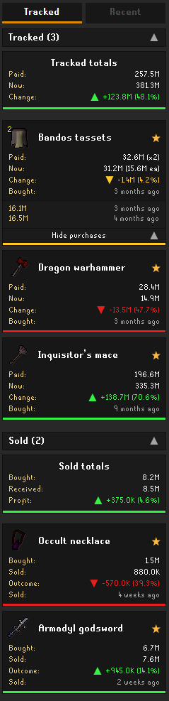
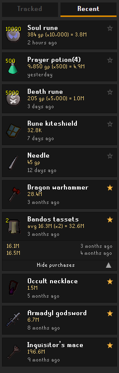

# Price Paid

A RuneLite [plugin](https://runelite.net/plugin-hub/show/price-paid) that remembers what you paid for items on the Grand Exchange and shows how their value has changed since.

&nbsp;&nbsp;&nbsp;&nbsp;&nbsp;&nbsp;&nbsp;&nbsp;&nbsp;&nbsp;

## Features

- Every GE buy lands in a rolling _Recent_ feed; star the ones you want to keep
- _Tracked_ items show what you paid, what they're worth now, and the change in gp and percent
- Expensive purchases (100k+ per item by default) are tracked _automatically_, consumables excluded
- Repeat buys of the same item are grouped with an average price and a full per purchase breakdown
- Sell a tracked item and the card locks in the final outcome, with GE tax already deducted
- Purchase dates shown as relative time ("9 months ago") or exact dates, your pick
- Current prices come from the client's built in wiki price feed, so no external calls
- History is saved _per character_ and syncs between PCs when you're signed into a [RuneLite account](https://runelite.net/account)

## Known limitations

- Item recipes are _not_ tracked
- Offers placed _and_ collected entirely outside RuneLite (e.g. on mobile) are never seen. Offers that fill while you're logged out are picked up at your next RuneLite login, but dated to when you logged in
- Only Grand Exchange trades count; shop purchases and player trades are not tracked
- The _Recent_ feed keeps your last 200 purchases. Starred items are kept until you unstar them

## Installation

Install [Price Paid](https://runelite.net/plugin-hub/show/price-paid) from the _in-game_ RuneLite plugin hub.
